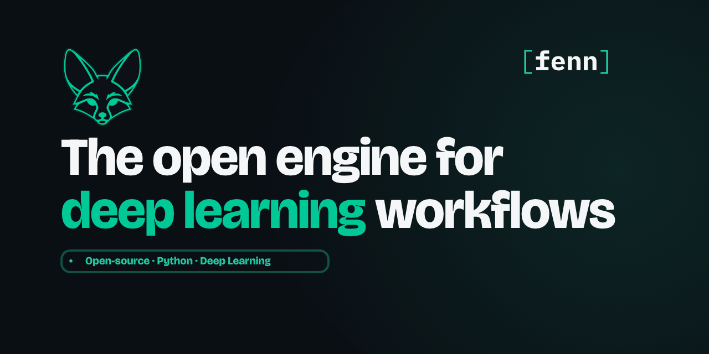

# Fenn: Friendly Environment for Neural Networks

<p align="center"></p>

<div align="center">

  [](https://app.codacy.com/gh/blkdmr/fenn/dashboard?utm_source=gh&utm_medium=referral&utm_content=&utm_campaign=Badge_grade) [](https://codecov.io/gh/pyfenn/fenn)
  [](https://pypi.org/project/fenn/) [](https://discord.gg/WxDkvktBAa)[](https://github.com/sponsors/blkdmr)

</div>

**Stop writing boilerplate. Start training.**

Friendly Environment for Neural Networks (fenn) is a simple framework that automates ML/DL workflows by providing prebuilt trainers, templates, logging, configuration management, and much more. With fenn, you can focus on your model and data while it takes care of the rest.

<p align="center"></p>

## Support fenn

If fenn is useful for your work or research, consider supporting its development.

You can support the project by **starring the repository** on GitHub. It improves visibility and helps others discover fenn.

Sponsorship also helps fund maintenance, improvements, and new features.

Support the project:
https://github.com/sponsors/blkdmr

## Why fenn?

- **Auto-Configuration**: YAML files are automatically parsed and injected into your entrypoint with CLI override support. No more hardcoded hyperparameters or scattered config logic.

- **Unified Logging**: All logs, print statements, and experiment metadata are automatically captured to local files and remote tracking backends simultaneously with no manual setup required.

- **Backend Monitoring**: Native integration with industry-standard trackers like [Weights & Biases](https://wandb.ai/) (W&B) for centralized experiment tracking and [TensorBoard](https://www.tensorflow.org/tensorboard) for real-time metric visualization

- **Instant Notifications**: Get real-time alerts on **Discord** and **Telegram** when experiments start, complete, or fail—no polling or manual checks.

- **Trainers**: Built-in support for training loops, validation, and testing with minimal boilerplate. Just define your model and data, and let fenn handle the rest.

- **Template Ready**: Built-in support for reproducible, shareable experiment templates.


## Quickstart

Install the fenn library using

```bash
pip install fenn
```

or 

```bash
uv pip install fenn
```

### Initialize a Project

Run the CLI tool to see which repositories are available and to download a template together with its configuration file. First, list the available repositories:

```bash
fenn list
````

Then, download one of the available templates (here `empty` is just an example):

```bash
fenn pull empty
```

This command downloads the selected template into the current directory and generates the corresponding configuration file, which can be customized before running or extending the project.

### Configuration

fenn relies on a simple YAML structure to define hyperparameters, paths, logging options, and integrations. You can configure the ``fenn.yaml`` file with the hyperparameters and options for your project.

The structure of the ``fenn.yaml`` file is:

```yaml
# ---------------------------------------
# Fenn Configuration (Modify Carefully)
# ---------------------------------------

project: empty

# ---------------------------
# Logging & Tracking
# ---------------------------

logger:
  dir: logger

# ---------------------------------------
# Example of User Section
# ---------------------------------------

train:
    lr: 0.001
```

### Write Your Code

Use the `@app.entrypoint` decorator. Your configuration variables are automatically passed via `args`.

```python
from fenn import Fenn

app = Fenn()

@app.entrypoint
def main(args):
    # 'args' contains your fenn.yaml configurations
    print(f"Training with learning rate: {args['train']['lr']}")

    # Your logic here...

if __name__ == "__main__":
    app.run()
```

By default, fenn will look for a configuration file named `fenn.yaml` in the current directory. If you would like to use a different name, a different location, or have multiple configuration files for different configurations, you can call `set_config_file()` and update the path or the name of your configuration file. You must assign the filename before calling `run()`.

```python
app = Fenn()
app.set_config_file("my_file.yaml")
```

### Run It

You can run your code as usual

```bash
python main.py
```

and fenn will take care of the rest for you.

### Training Models

Use built-in trainers to handle your training loops with minimal boilerplate.

```python
import torch.nn as nn
import torch.optim as optim

from fenn.nn.trainers import ClassificationTrainer
from fenn.nn.utils import Checkpoint

@app.entrypoint
def main(args):
        
    # Define your data
    train_loader = DataLoader(train_dataset, batch_size=args["train"]["batch"], shuffle=True)
    val_loader = DataLoader(val_dataset, batch_size=args["test"]["batch"], shuffle=False)
    test_loader = DataLoader(test_dataset, batch_size=args["test"]["batch"], shuffle=False)
    
    # Define your model
    model = nn.Sequential( ... )     
    loss = nn.CrossEntropyLoss()
    optimizer = optim.Adam(model.parameters(),
                            lr=float(args["train"]["lr"]))

    # Initialize a ClassificationTrainer
    trainer = ClassificationTrainer(
        model=model,
        loss_fn=loss,
        optim=optimizer,
        num_classes=4
    )

    # Train and predict your model
    trainer.fit(train_loader, epochs=10, val_loader=val_loader)
    preds = trainer.predict(test_loader)
```

## Contributing

Contributions are welcome! 

Interested in contributing? Join the community on [Discord](https://discord.gg/WxDkvktBAa).

We can then discuss a possible contribution together, answer any questions, and help you get started!

**Please consult our CONTRIBUTING.md and CODE_OF_CONDUCT.md before opening a pull request.**

## Maintainers

The development and long-term direction of **fenn** is guided by the following maintainers:

| Maintainer | Role |
|------------|------|
| [@blkdmr](https://github.com/blkdmr) | Creator & Project Administrator |
| [@giuliaOddi](https://github.com/giuliaOddi) | Project Administrator |
| [@GlowCheese](https://github.com/GlowCheese) | Core Maintainer |
| [@franciscolima05](https://github.com/franciscolima05) | Core Maintainer |

Maintainers oversee the project roadmap, review pull requests, coordinate releases, and ensure the long-term stability and quality of the framework.

Thank you for supporting the project.